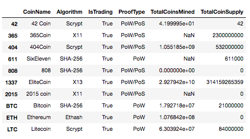
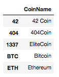
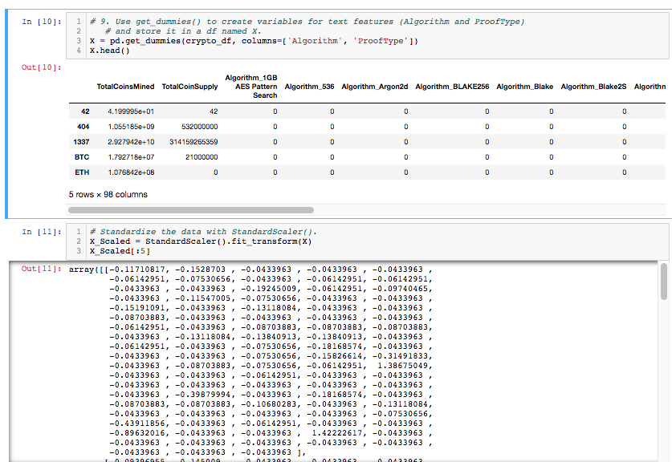
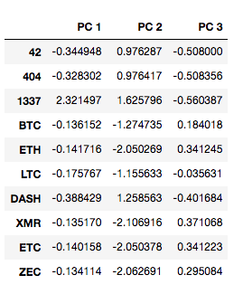
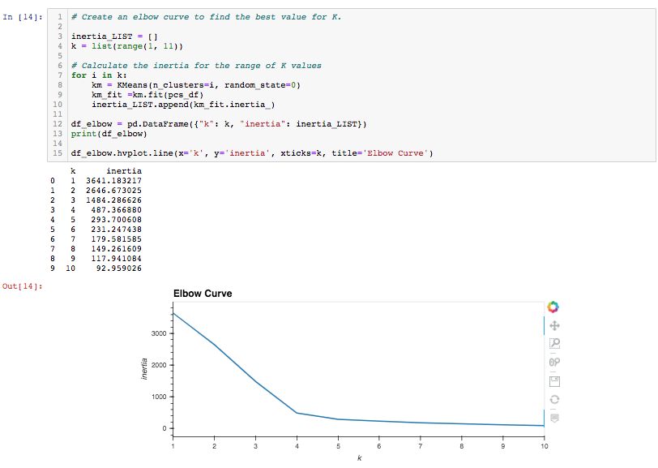
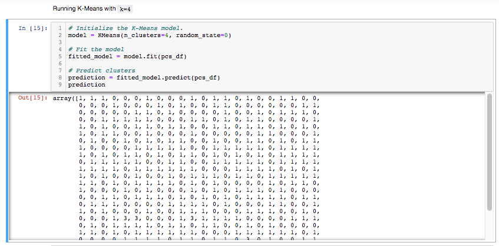
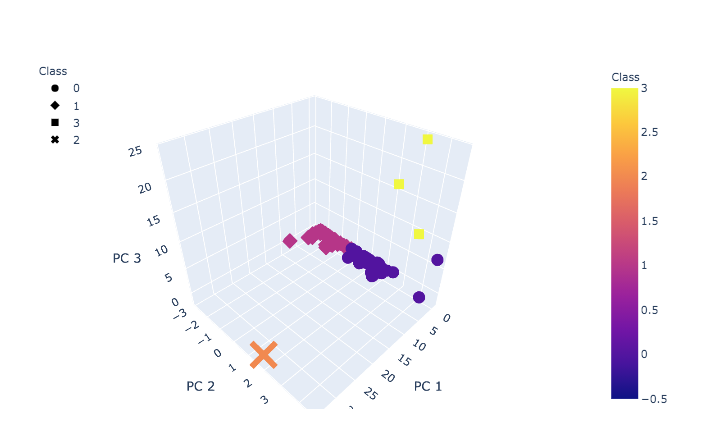
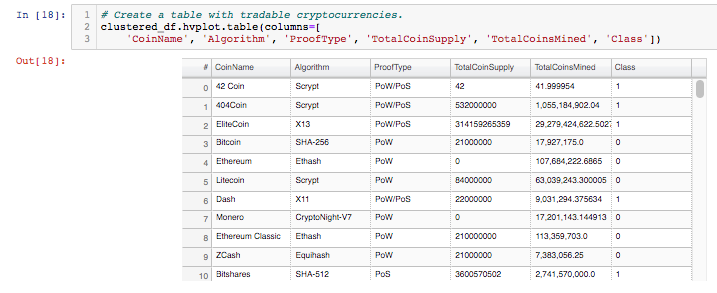
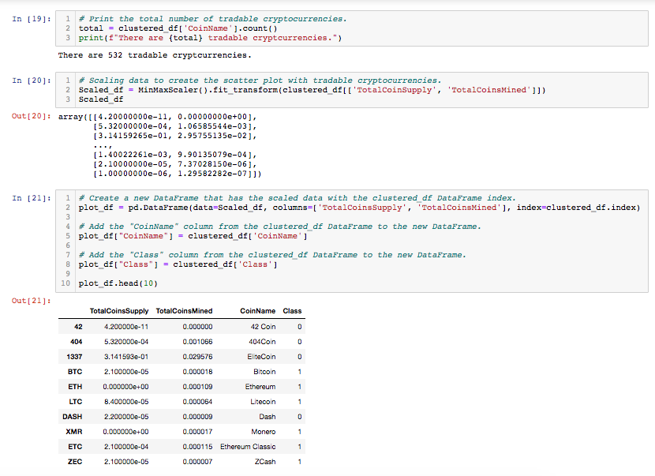
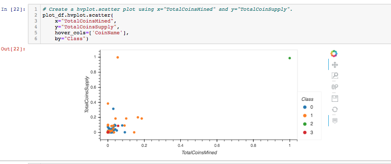

# Cryptocurrencies

## Overview of the Analysis

The purpose of this project was to use unsupervised learning algorithms in order to assist a manager for a fictitious investment bank in performing an analysis on a dataset of cryptocurrencies to establish clusters (groups) in the data.  The hope for the client is that once the groups of cryptocurrencies were established, the clusters could be further investigated to determine their meaning and, ideally, whether each group represents differences in investment viability for their customers.

---------------------------------------------
## Resources:

Data Sources: 
    
    crypto_data.csv

    

Software: 

    Python 3.8.3
    Jupyter Notebook 6.0.3
    Visual Studio Code 1.49.2 
    pandas 1.0.5
    Scikit-learn 0.23.2
    hvplot 0.7.0

-------------
## Preprocessing:
-------------

To perform this analysis, the following dataset of cryptocurrencies with six features was loaded into a dataframe.  Notably, unsupervised learning is performed strictly on unlabeled input data with no defined output (target) and all of our inputs were provided by this dataset of about 1,200 observations.

In order to prepare the data to create clusters from unsupervised learning models, a significant amount of preprocessing was necessary.  This involved filtering to only include currencies still being traded on the market, removing rows of missing values, and splitting the data into two dataframes.  The first dataframe was only for coin names and the other dataframe contained the columns "algorithm", "ProofType", "TotalCoinsMined", and "TotalCoinSupply" as this second dataframe would be used for clustering.  

Since the unsupervised learning models required all data input to be numerical, the pandas "get_dummmies" method was employed on the algorithm and prooftype columns to create "dummy" numerical columns.  Finally, the dataframe was scaled using the StandardScaler method from scikit-learn's library.

---------
## Principal Component Analysis

Once the dataframe that was set aside for clustering had been numericalized and scaled, the data dimensions were excessive in number of features.  To reduce the dimensions and to avoid overfitting of the data, the features were reduced to three principal components as follows:

---------
## Determining Number of Clusters for K-means

To determine the number of clusters to use for our unsupervised model, an elbow curve was used.  By looping through a list of potential cluster (k) numbers using the k-means algorithm on the principal components, the elbow curve displayed the inertia values of each number.  Since the curve appeared to reach near-horizontial orientation around four "k" clusters, this allowed us to select "four" as the number of clusters to use in our k-means algorithm in the next step.

--------
## K-Means algorithm to cluster 4 groups

Once we had established to use four clusters, the k-means algorithm was used to classify the input data, in this case the principal components dataframe, into the four desired classes which would correspond to their numerical similarities established according to the algorithm.  The data grouped each class as 0,1,2, or 3.  

Given that the numerical data was now grouped into four classes, a conglomerative dataframe was concatinated to contain the coin name, the four columns used for the numerical input, the three principal components, and the newly created classes.

## Results:

Of course, the results of the unsupervised learning model were the for classes or clusters of four groups created from the principal components.  However, the relationships and dispersion of the classes were more intuitively viewable by plotting the groups in the three spatial dimensions for each principal component.  Seen below is a 3-dimensional representation made possible by the express module from the plotly library.  Some examples revealed by the 3D plot, class 0 and 1 appear to possess more similarity in their PC 2 and PC 1 dimensions, whereas classes 2 and 3 appear to exhbit vaster separation in PC 3 values from the first two classes.

For organizational purposes, a new dataframe vizualization was created without the vestigial three principal component columns by using hvplot (see below). 

 A count was taken of the coin name column and revealed there are 532 tradable cryptocurrencies and scikit-learn's MinMaxScaler was used on the 'TotalCoinSupply' and 'TotalCoinsMined'columns to scale them down to reside within the range of 0 to 1.

Finally, a scatter plot was created to exhibit the 2 dimensional relationship of each observation with the total number of coins mined vs the total coins supply, with the color of datapoints designated to represent each of the four classes (0,1,2, or 3).  As seen from the image below, most of the data falls in a similar range but there may be a couple outliers in the dataset from two different classes (1 and 2).

## Summary

Overall, using the K-means algorithm was successful at producing four clusters of cryptocurrencies according to their similarities in the metrics provided by the dataset.  Of course, there are other unsupervised learning options we could have employed, such as heirarchal clustering (which would've involved a dendrogram instead of an elbow curve to determine the number of clusters ('k')), but the k-means algorithm sufficed quite well, especially with the aid of the elbow curve test.  Ultimately, the investment bank client could use these classifications for further research to help their customers build a useful cryptocurrency portfolio.